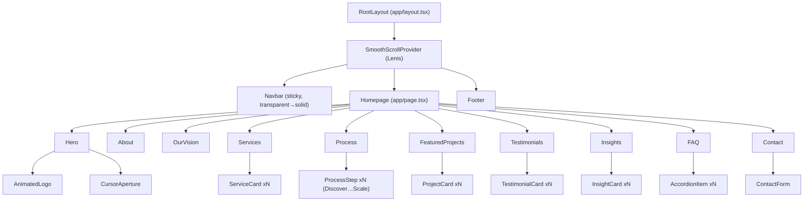
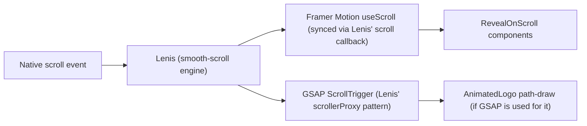
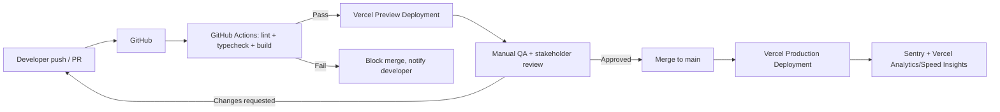
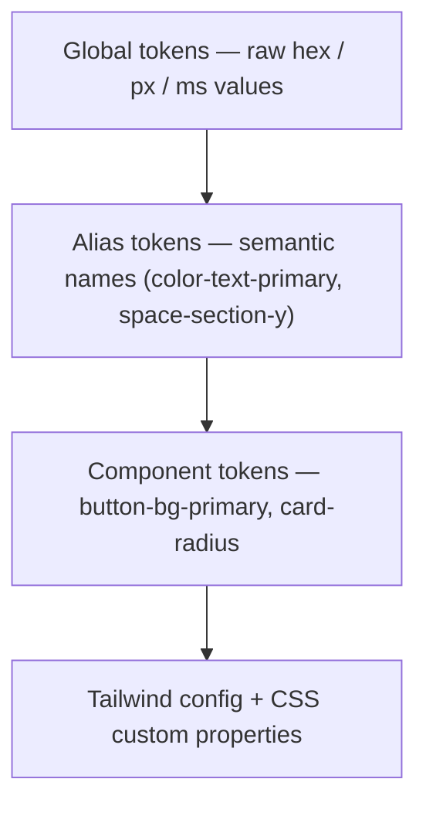

# Vision Wings — Architecture Document

| | |
|---|---|
| **Project** | Vision Wings — Premium Marketing Agency Website |
| **Document** | Technical Architecture |
| **Version** | 1.0 |
| **Status** | Draft for Engineering Review |
| **Last Updated** | July 23, 2026 |
| **Owner** | Engineering / Full Stack Architecture |

## Table of Contents

1. [Tech Stack](#1-tech-stack)
2. [Folder Structure](#2-folder-structure)
3. [Routing](#3-routing)
4. [Component Hierarchy](#4-component-hierarchy)
5. [State Management](#5-state-management)
6. [Animation Architecture](#6-animation-architecture)
7. [SEO Strategy](#7-seo-strategy)
8. [Image Optimization](#8-image-optimization)
9. [API Structure](#9-api-structure)
10. [CMS Integration](#10-cms-integration)
11. [Deployment Strategy](#11-deployment-strategy)
12. [CI/CD](#12-cicd)
13. [Security](#13-security)
14. [Performance Strategy](#14-performance-strategy)
15. [Scalability](#15-scalability)
16. [Design Tokens](#16-design-tokens)
17. [Reusable Components](#17-reusable-components)

---

## 1. Tech Stack

| Layer | Choice | Rationale |
|---|---|---|
| Framework | Next.js (App Router) | Server components, built-in ISR, native Metadata API for SEO, best-in-class Vercel deployment story |
| Language | TypeScript | Contract safety across CMS content, component props, and API routes |
| Styling | Tailwind CSS | Utility-first speed; design tokens map directly to `tailwind.config` — see [§16](#16-design-tokens) |
| UI primitives | ShadCN UI | Accessible, unstyled-by-default primitives (Radix underneath) we skin with our own tokens rather than fighting a pre-styled kit |
| Animation | Framer Motion (primary) | Declarative, React-native, handles 90% of reveal/hover/transition needs |
| Animation (supplementary) | GSAP — **only if needed** | Reserved for the logo line-draw SVG path animation and any scroll-choreography Framer Motion can't express cleanly. Loaded via dynamic import so it never taxes the initial bundle if unused on a given route |
| Smooth scroll | Lenis | Provides the single source of scroll-position truth that both Framer Motion's `useScroll` and any GSAP ScrollTrigger instances subscribe to (see [§6](#6-animation-architecture) for why this matters) |
| Icons | React Icons | Consistent line-icon set; restricted in practice to a single sub-family (Phosphor or Feather via `react-icons`) for visual consistency — never mix icon families |
| CMS | **Sanity.io** | Structured content + Portable Text suits long-form Insights articles and flexible Featured Project case studies better than a rigid-field CMS; generous free tier; real-time collaborative Studio; first-class `next-sanity` integration |
| Forms/Email | Next.js API route + **Resend** | Modern deliverability, simple API, good Next.js DX |
| Bot protection | **Cloudflare Turnstile** | Invisible/low-friction alternative to reCAPTCHA — avoids the visible reCAPTCHA badge that undercuts a premium visual experience |
| Analytics | **Vercel Analytics + Speed Insights**, optionally Plausible | Lightweight, privacy-respecting, no heavy third-party script tax on performance budget |
| Error monitoring | Sentry | Standard, well-integrated with Next.js and Vercel |
| Deployment | Vercel | Native Next.js support, preview deployments per PR, edge network |

## 2. Folder Structure

```
vision-wing/
├── app/
│   ├── layout.tsx                  # Root layout: fonts, Lenis provider, nav, footer
│   ├── page.tsx                    # Homepage — composes all narrative sections
│   ├── globals.css                 # Tailwind base + CSS custom properties (design tokens)
│   ├── work/
│   │   ├── page.tsx                 # Featured Projects index (if expanded beyond homepage teaser)
│   │   └── [slug]/page.tsx          # Case study detail (Sanity-driven)
│   ├── insights/
│   │   ├── page.tsx                 # Insights index
│   │   └── [slug]/page.tsx          # Article detail (Sanity-driven)
│   ├── api/
│   │   ├── contact/route.ts         # Contact form submission handler
│   │   └── revalidate/route.ts      # Sanity webhook → on-demand ISR
│   ├── sitemap.ts                   # Dynamic sitemap generation
│   ├── robots.ts                    # robots.txt generation
│   └── not-found.tsx                # Designed 404 (not the framework default)
├── components/
│   ├── layout/
│   │   ├── Navbar.tsx
│   │   ├── MobileMenu.tsx
│   │   └── Footer.tsx
│   ├── sections/
│   │   ├── Hero.tsx
│   │   ├── About.tsx
│   │   ├── OurVision.tsx
│   │   ├── Services.tsx
│   │   ├── Process.tsx
│   │   ├── FeaturedProjects.tsx
│   │   ├── Testimonials.tsx
│   │   ├── Insights.tsx
│   │   ├── FAQ.tsx
│   │   └── Contact.tsx
│   ├── motion/
│   │   ├── AnimatedLogo.tsx          # Globe → Wing → Eye line-draw (GSAP or Framer, SVG-based)
│   │   ├── CursorAperture.tsx        # Custom precision cursor, desktop pointer only
│   │   ├── RevealOnScroll.tsx        # Shared fade/rise wrapper for scroll-triggered content
│   │   └── SmoothScrollProvider.tsx  # Lenis initialization + context
│   └── ui/                            # ShadCN-derived primitives (Button, Input, Accordion, Card…)
├── lib/
│   ├── sanity/
│   │   ├── client.ts
│   │   ├── queries.ts
│   │   └── image.ts                  # Sanity image URL builder helpers
│   ├── validations/
│   │   └── contact-form.ts           # Zod schema shared by client + API route
│   └── seo/
│       ├── metadata.ts               # Shared metadata builder helpers
│       └── structured-data.ts        # JSON-LD builders (Organization, Article, FAQPage)
├── styles/
│   └── tokens.css                    # Design tokens as CSS custom properties (see §16)
├── public/
│   ├── fonts/                         # Self-hosted League Spartan + DM Sans (see §14)
│   └── favicon assets
├── tailwind.config.ts
├── next.config.ts
└── package.json
```

## 3. Routing

| Route | Type | Rendering strategy | Notes |
|---|---|---|---|
| `/` | Static/homepage | Static Generation + ISR | All narrative sections; Featured Projects/Testimonials/Insights pull latest N entries from Sanity at build/revalidate time |
| `/work/[slug]` | Dynamic | ISR (revalidated on Sanity publish webhook) | Case study detail |
| `/insights` | Static list | ISR | Paginated or "load more" article index |
| `/insights/[slug]` | Dynamic | ISR | Article detail; includes `Article` JSON-LD |
| `/api/contact` | API route | N/A (server action) | POST only; validates via shared Zod schema |
| `/api/revalidate` | API route | N/A | Sanity webhook target; verifies signing secret before revalidating |
| `/sitemap.xml` | Generated | Rebuilt on revalidation | via `app/sitemap.ts` |
| `/robots.txt` | Generated | Static | via `app/robots.ts` |
| `*` (unmatched) | Static | N/A | Custom-designed 404, on-brand, includes nav back to Hero |

## 4. Component Hierarchy



Every section component wraps its scroll-triggered children in the shared `RevealOnScroll` primitive rather than each section re-implementing its own IntersectionObserver/animation logic — this is the single biggest lever for keeping animation behavior (and reduced-motion handling) consistent sitewide.

## 5. State Management

**No external global state library (Redux, Zustand, Jotai) is used.** This is a deliberate architectural decision, not an omission: Vision Wings is a narrative content site, not an application with complex cross-cutting client state. Introducing a state library here would be over-engineering relative to actual need — the same restraint principle that governs the visual design should govern the codebase.

| State need | Mechanism |
|---|---|
| Mobile menu open/closed | Local `useState` in `Navbar` |
| Nav "solid vs. transparent" toggle | Local `useState` driven by a scroll-position listener (fed by Lenis, not a raw scroll event — see §6) |
| Active FAQ accordion item(s) | Local `useState` in `FAQ`, or ShadCN Accordion's built-in state if using its controlled mode |
| Cursor position / hover-target variant | `React.Context` (`CursorContext`) — the only genuinely cross-cutting client state, since any component can register as a cursor "hover target" |
| Contact form fields + validation state | Local form state via `react-hook-form` + shared Zod schema (`lib/validations/contact-form.ts`) |
| Reduced-motion preference | Read once via `window.matchMedia('(prefers-reduced-motion: reduce)')` in a small `useReducedMotion` hook, consumed anywhere animation is authored |

## 6. Animation Architecture

The core architectural risk in this stack is **three motion systems (Framer Motion, GSAP, Lenis) each trying to own scroll**. If each manages its own scroll listener independently, the result is jank, conflicting scroll-jacking, and inconsistent behavior across browsers (Safari in particular).

**Resolution: Lenis is the single source of scroll truth.**



- **Framer Motion** owns: section reveal-on-scroll (fade/rise), hover states, page-level transitions, the cursor aperture's spring physics.
- **GSAP** is scoped *only* to the logo's SVG path-draw animation, loaded via dynamic `import()` so routes that don't render the logo never pay its bundle cost. If Framer Motion's `pathLength` animation proves sufficient during Phase 6 prototyping, GSAP is dropped entirely — per the brief's own "GSAP only if needed."
- **Lenis** feeds scroll position to both, so there is exactly one scroll listener at the top of the tree, not three.
- **Reduced motion:** the `useReducedMotion` hook (see §5) short-circuits `RevealOnScroll` to render children at full opacity/position immediately, disables Lenis's smoothing (falls back to native scroll), and skips the GSAP path-draw in favor of the logo appearing fully drawn/static.

## 7. SEO Strategy

- Next.js **Metadata API** (`generateMetadata`) used per route for `<title>`, description, canonical URL, and Open Graph tags — no manual `<head>` manipulation.
- JSON-LD structured data injected via a small `<StructuredData data={...} />` component using `lib/seo/structured-data.ts` builders:
  - `Organization` schema on every page (sitewide identity, logo, social profiles).
  - `Article` schema on each Insights detail page (headline, author, datePublished, image).
  - `FAQPage` schema generated from the same content that powers the visual FAQ accordion — single source of truth, no duplicated copy.
  - `BreadcrumbList` on `/work/[slug]` and `/insights/[slug]`.
- `app/sitemap.ts` dynamically includes all published Sanity slugs at build/revalidation time (no manually maintained sitemap).
- Dynamic OG image generation (`next/og`) as a fallback for any Insights/Work entry without a custom-uploaded social image, so nothing ships with a broken/default share card.

## 8. Image Optimization

- All images served through `next/image` — automatic AVIF/WebP negotiation, responsive `srcset`, and lazy-loading below the fold by default.
- Hero and above-the-fold imagery (if any) explicitly marked `priority` to avoid LCP penalties.
- Sanity-sourced images (Featured Projects, Insights) use the Sanity image pipeline (`@sanity/image-url`) to request appropriately sized, format-negotiated assets rather than serving one large source file to every viewport.
- Explicit `width`/`height` (or `fill` with a sized parent) on every image to guarantee zero layout shift — directly supports the CLS < 0.1 budget in the PRD.
- No stock-photo clichés (handshakes, lightbulbs, generic "team laughing at laptop") — photography direction is governed by [Design.md § Photography Style](./Design.md#photography-style).

## 9. API Structure

| Endpoint | Method | Purpose | Notes |
|---|---|---|---|
| `/api/contact` | `POST` | Receives contact form payload | Validates with shared Zod schema, verifies Turnstile token, sends via Resend (confirmation to user + notification to internal inbox), rate-limited per IP |
| `/api/revalidate` | `POST` | Sanity webhook target | Verifies Sanity webhook signing secret; calls `revalidatePath`/`revalidateTag` for the affected route only (not a full-site rebuild) |

The site intentionally has a minimal API surface. There is no need for a broader REST/GraphQL layer — content reads happen at the server-component level directly against Sanity's client, not through an intermediate API route.

## 10. CMS Integration

**Sanity.io**, integrated via `next-sanity`.

**Content models:**

| Schema | Key fields | Notes |
|---|---|---|
| `project` (Featured Projects) | title, slug, client, industry, summary, coverImage, bodyPortableText, outcomeMetrics (repeatable stat blocks), relatedInsights (reference) | Portable Text allows mixed rich content (pull quotes, image breaks) rather than a single rigid body field |
| `insight` (Insights articles) | title, slug, author, publishDate, excerpt, coverImage, bodyPortableText, relatedProjects (reference) | |
| `testimonial` | quote, attributionName, attributionRole, company, relatedProject (optional reference) | |
| `faqItem` | question, answerPortableText, order | Order field lets marketing reorder without a deploy |
| `siteSettings` (singleton) | nav labels, social links, default OG image, footer content | Avoids hardcoding editable copy in components |

- **Preview mode:** Sanity's Presentation tool / Next.js Draft Mode wired together so editors can preview unpublished content against the live design.
- **Editorial workflow:** content edits publish → Sanity webhook fires → `/api/revalidate` → only the affected route(s) are revalidated (on-demand ISR), so publishing a typo fix doesn't trigger a full redeploy.

## 11. Deployment Strategy

- **Platform:** Vercel, connected directly to the GitHub repository.
- **Environments:**
  - `Production` — `main` branch, custom domain.
  - `Preview` — automatic per-pull-request deployments, used for stakeholder review during Phases 4–10.
  - `Development` — local, using a separate Sanity dataset (`development`) to avoid polluting production content during testing.
- **Environment variables:** Sanity project ID/dataset/token, Resend API key, Turnstile secret, Sentry DSN — managed via Vercel's environment variable UI, scoped per environment, never committed to the repo.

## 12. CI/CD



- GitHub Actions runs `eslint`, `tsc --noEmit`, and a production build on every PR before it's even eligible for preview review.
- No merge to `main` without a green CI run and an approved preview review.
- Production deploys are automatic on merge to `main` — no manual deploy step, reducing the chance of "it worked on my machine."

## 13. Security

- **Headers:** `Content-Security-Policy`, `X-Content-Type-Options: nosniff`, `Referrer-Policy: strict-origin-when-cross-origin`, and `Permissions-Policy` set via `next.config.ts` headers configuration.
- **Form protection:** server-side validation always re-runs regardless of client-side validation state (never trust the client); Cloudflare Turnstile token verified server-side before any email is sent; per-IP rate limiting on `/api/contact`.
- **Webhook verification:** `/api/revalidate` rejects any request that doesn't carry a valid Sanity webhook signature — prevents arbitrary third parties from triggering revalidation.
- **Dependency hygiene:** Dependabot (or equivalent) enabled on the repository; `npm audit` run as part of CI for high/critical vulnerabilities.
- **Secrets:** no API keys or tokens in client-side bundles; anything used in a Client Component is explicitly public-safe (Sanity's public read token is the only credential ever exposed client-side, and it is read-only).

## 14. Performance Strategy

- **Fonts:** League Spartan and DM Sans self-hosted (via `next/font/local` or `next/font/google` with `display: swap`), subsetted to the Latin character set actually used, preloaded for the above-the-fold weights only.
- **Code splitting:** GSAP and any heavy, below-the-fold section logic dynamically imported (`next/dynamic`) so the initial JS payload only includes what the Hero needs to become interactive.
- **Bundle discipline:** the animation-library budget in the PRD (§14, <250KB gzipped initial route) is enforced via periodic `next build` bundle analysis (`@next/bundle-analyzer`), checked at the end of Phase 9.
- **Third-party scripts:** kept to the minimum in §1 (Vercel Analytics, Sentry, Turnstile) — no marketing pixel sprawl without an explicit performance-budget review.
- **Rendering strategy:** Static Generation + ISR everywhere content allows it, so most requests are served from Vercel's edge cache rather than computed per-request.

## 15. Scalability

- **Content scale:** ISR means Featured Projects and Insights can grow from 5 entries to 500 without a rebuild-time penalty — each page revalidates independently.
- **Traffic scale:** Static/ISR pages served from Vercel's edge network absorb traffic spikes (e.g., a press mention or viral Insights post) without origin load concerns.
- **Team scale:** the `components/sections/` + `components/motion/` split means a new section (e.g., a future "Careers" page) can be added by composing existing motion primitives rather than reinventing scroll-reveal logic.
- **CMS scale:** Sanity's dataset model supports a straightforward path to a `staging` dataset if a formal content-review workflow becomes necessary later, without changing the frontend integration.
- **Monitoring at scale:** Sentry + Vercel Analytics provide the visibility needed to catch performance regressions before they compound as content volume grows.

## 16. Design Tokens

Design tokens are authored once (as CSS custom properties in `styles/tokens.css`) and consumed by Tailwind via `tailwind.config.ts`, so design and implementation can never drift out of sync. Full token rationale lives in [Design.md § Design Tokens](./Design.md#design-tokens-1); this is the implementation-facing view.



```css
/* styles/tokens.css (excerpt) */
:root {
  /* Global — color */
  --color-navy-950: #0F172A;   /* Primary Navy (brand-given) */
  --color-bronze-500: #B87333; /* Bronze (brand-given) */
  --color-bronze-900: #652209; /* Dark Bronze (brand-given) */
  --color-warm-50: #FFF8EF;    /* Warm Background (brand-given) */

  /* Alias — semantic */
  --color-bg-base: var(--color-warm-50);
  --color-text-primary: var(--color-navy-950);
  --color-accent-primary: var(--color-bronze-500);
  --color-accent-strong: var(--color-bronze-900);

  /* Global — spacing (4px base, aligns with Tailwind defaults) */
  --space-4: 0.25rem;  /* 4px  */
  --space-16: 1rem;    /* 16px */
  --space-24: 1.5rem;  /* 24px */
  --space-96: 6rem;    /* 96px */

  /* Global — motion */
  --duration-base: 350ms;
  --ease-out-expo: cubic-bezier(0.16, 1, 0.3, 1);
}
```

```ts
// tailwind.config.ts (excerpt)
theme: {
  extend: {
    colors: {
      navy: { 950: 'var(--color-navy-950)' /* …full scale, see Design.md */ },
      bronze: { 500: 'var(--color-bronze-500)', 900: 'var(--color-bronze-900)' },
      warm: { 50: 'var(--color-warm-50)' },
    },
    fontFamily: {
      display: ['League Spartan', 'sans-serif'],
      body: ['DM Sans', 'sans-serif'],
    },
    transitionTimingFunction: {
      'out-expo': 'var(--ease-out-expo)',
    },
  },
}
```

## 17. Reusable Components

| Component | Location | Reused by |
|---|---|---|
| `RevealOnScroll` | `components/motion/` | Every section — the shared scroll-reveal wrapper (see §6) |
| `Button` | `components/ui/` | Hero CTAs, Contact form submit, Card "view case study" links |
| `Card` | `components/ui/` | `ProjectCard`, `InsightCard`, `TestimonialCard` all compose this base |
| `Accordion` | `components/ui/` (ShadCN-derived) | FAQ; potentially Services detail expansion |
| `SectionHeading` | `components/ui/` | Standardizes the eyebrow + heading + optional subheading pattern used at the top of every section |
| `AnimatedLogo` | `components/motion/` | Hero; also reused at reduced scale in Navbar and as a loading indicator |
| `CursorAperture` | `components/motion/` | Mounted once in root layout, active globally on pointer devices |

Each component in `components/ui/` follows the variant/state/accessibility documentation pattern defined in [Design.md § Component Library](./Design.md#component-library) — Architecture.md defines *where components live and how they connect*; Design.md defines *how each one looks, behaves, and is specified*.

---

*Related documents: [PRD.md](./PRD.md) · [Phases.md](./Phases.md) · [Design.md](./Design.md)*
