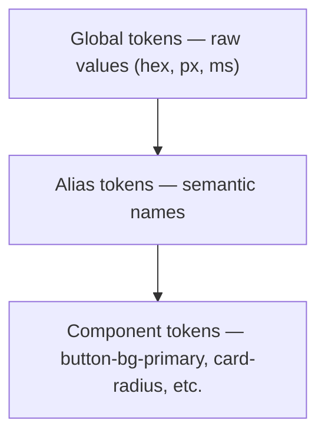
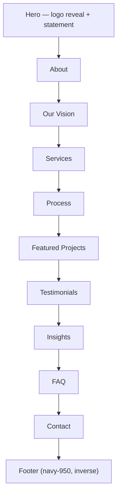

# Vision Wings — Design System

| | |
|---|---|
| **Project** | Vision Wings — Premium Marketing Agency Website |
| **Document** | Design System |
| **Version** | 1.0 |
| **Status** | Draft for Design & Engineering Review |
| **Last Updated** | July 23, 2026 |

## Table of Contents

1. [Design Philosophy](#1-design-philosophy)
2. [Grid System](#2-grid-system)
3. [Spacing Scale](#3-spacing-scale)
4. [Typography Scale](#4-typography-scale)
5. [Color System](#5-color-system)
6. [Elevation](#6-elevation)
7. [Corner Radius](#7-corner-radius)
8. [Buttons](#8-buttons)
9. [Inputs](#9-inputs)
10. [Cards](#10-cards)
11. [Navigation](#11-navigation)
12. [Sections](#12-sections)
13. [Hero Design](#13-hero-design)
14. [Motion Guidelines](#14-motion-guidelines)
15. [Animation Timing](#15-animation-timing)
16. [Iconography](#16-iconography)
17. [Illustration Style](#17-illustration-style)
18. [Photography Style](#18-photography-style)
19. [Component Library](#19-component-library)
20. [Responsive Breakpoints](#20-responsive-breakpoints)
21. [Dark Mode Strategy](#21-dark-mode-strategy)
22. [Accessibility Rules](#22-accessibility-rules)
23. [Do & Don't](#23-do--dont)
24. [Interaction Design](#24-interaction-design)
25. [Micro Animations](#25-micro-animations)
26. [Design Tokens](#26-design-tokens)
27. [UI Patterns](#27-ui-patterns)
28. [Visual Examples](#28-visual-examples)

---

## 1. Design Philosophy

Five principles govern every decision in this system. When a new pattern isn't covered here, test it against these before inventing something new.

1. **Editorial over promotional.** The site reads like a well-typeset publication that happens to sell strategy and design — not a landing page that happens to have some big text. When in doubt, remove a marketing flourish and let the typography and whitespace carry the message.
2. **Whitespace is a material, not a gap.** Generous space around elements is a deliberate signal of confidence, not empty real estate to be filled. Never compress spacing to "fit more in."
3. **Motion means something.** Every animation should trace back to Growth/Momentum (the Wing) or Precision/Insight (the Eagle Eye). If a motion effect doesn't serve one of those two ideas, cut it.
4. **Precision over decoration.** Sharp typographic hierarchy, exact alignment, and restrained color use stand in for the "insight and strategic thinking" the brand promises. Decoration (gradients, blobs, glass panels) is explicitly rejected — see [§23](#23-do--dont).
5. **One signature moment, quiet everywhere else.** The site's boldness is spent entirely on the logo reveal and the precision cursor (see [§13](#13-hero-design) and [§24](#24-interaction-design)). Everything else — cards, buttons, section rhythm — stays disciplined so that signature moment actually reads as special.

## 2. Grid System

| Breakpoint | Columns | Container max-width | Gutter | Outer margin |
|---|---|---|---|---|
| Desktop (≥1280px) | 12 | 1280px | 32px | 80px (fluid beyond 1280px container) |
| Laptop (1024–1279px) | 12 | fluid | 24px | 64px |
| Tablet (768–1023px) | 8 | fluid | 24px | 40px |
| Mobile (375–767px) | 4 | fluid | 16px | 20px |

- Content rarely spans the full 12 columns — editorial layouts in this system typically use 7–8 columns for body copy and reserve the remainder as intentional whitespace or a supporting visual (asymmetry is a feature, not a bug, of the editorial direction).
- The Hero's large statement is one of the few elements permitted to run the full container width.

## 3. Spacing Scale

Base unit: **4px**, matching Tailwind's default scale directly — no custom spacing config needed except two large editorial values reserved for hero/section vertical rhythm.

| Token | Value | Typical use |
|---|---|---|
| `space-1` | 4px | Icon-to-label gaps |
| `space-2` | 8px | Tight inline spacing |
| `space-3` | 12px | Form field internal padding |
| `space-4` | 16px | Default component padding |
| `space-6` | 24px | Card padding, paragraph spacing |
| `space-8` | 32px | Gaps between related elements |
| `space-12` | 48px | Sub-section spacing |
| `space-16` | 64px | Section internal top/bottom padding (mobile) |
| `space-24` | 96px | Section internal top/bottom padding (tablet) |
| `space-32` | 128px | Section internal top/bottom padding (desktop) |
| `space-48` | 192px | Hero vertical padding (desktop) |
| `space-64` | 256px | Reserved — large editorial breaks only, used sparingly |

## 4. Typography Scale

**Headings:** League Spartan (Bold 700 for display/H1, SemiBold 600 for H2–H4)
**Body:** DM Sans (Regular 400 for body copy, Medium 500 for labels/emphasis)

Both are open-source Google Fonts — self-hosted via `next/font` for performance (see Architecture.md §14), not loaded from Google's runtime CDN.

| Token | Desktop | Tablet | Mobile | Line-height | Letter-spacing | Weight |
|---|---|---|---|---|---|---|
| `text-display` (Hero statement) | 96px | 64px | 40px | 1.05 | −0.02em | Bold 700 |
| `text-h1` | 56px | 40px | 32px | 1.1 | −0.01em | Bold 700 |
| `text-h2` | 40px | 32px | 26px | 1.15 | −0.01em | SemiBold 600 |
| `text-h3` | 28px | 24px | 22px | 1.2 | 0 | SemiBold 600 |
| `text-h4` / eyebrow label | 14px | 14px | 14px | 1.4 | +0.08em (uppercase) | Medium 500 |
| `text-body-lg` | 20px | 19px | 18px | 1.6 | 0 | Regular 400 |
| `text-body` | 16px | 16px | 16px | 1.7 | 0 | Regular 400 |
| `text-body-sm` | 14px | 14px | 14px | 1.6 | 0 | Regular 400 |
| `text-caption` | 12px | 12px | 12px | 1.5 | +0.02em | Regular 400 |

**Rules:**
- Negative letter-spacing is reserved for `text-display` and `text-h1` — this is what makes the large statement type feel tightly kerned and premium rather than default-browser-spaced.
- Eyebrow labels (small uppercase tags above section headings, e.g., "SERVICES," "PROCESS") use `text-h4` styling and should encode real structure (a section name, a step number) — never decorative filler text.
- Body copy never drops below 16px on any breakpoint; only captions go smaller.

## 5. Color System

The four brand colors are fixed inputs from the brief. This system extends them into a usable scale and — critically — documents exactly where each one is safe to use as text, based on verified contrast math.

| Color | Hex | Role |
|---|---|---|
| Primary Navy | `#0F172A` | Primary text, dark backgrounds, nav-solid state |
| Bronze | `#B87333` | Accent — large headings, icons, borders, hover states |
| Warm Background | `#FFF8EF` | Primary page background |
| Dark Bronze | `#652209` | Secondary accent, safe for small-text use |

*Note: `#0F172A` corresponds exactly to Tailwind's default `slate-900` — this brand color can be dropped into Tailwind's built-in slate scale as the 900 step with no custom config required, extending outward for lighter tints.*

**Extended scale** (derived tints/shades, proposed for a complete system — confirm with brand before final lock):

| Token | Hex | Token | Hex | Token | Hex |
|---|---|---|---|---|---|
| `navy-950` | #0F172A | `bronze-900` | #652209 | `warm-50` | #FFF8EF |
| `navy-900` | #16213D | `bronze-700` | #8A4A1C | `warm-100` | #FCF1E0 |
| `navy-700` | #2E3F5C | `bronze-500` | #B87333 | `warm-200` | #F5E6CC |
| `navy-500` | #4A5A78 | `bronze-300` | #D4A87A | | |
| `navy-300` | #8891A3 | `bronze-100` | #EDD9C0 | | |
| `navy-100` | #D8DCE3 | `bronze-50` | #F7EEE3 | | |

### Verified contrast ratios

| Pair | Ratio | AA normal text (4.5:1) | AA large text / UI (3:1) |
|---|---|---|---|
| Navy `#0F172A` on Warm `#FFF8EF` | **16.9 : 1** | ✅ Pass (exceeds AAA) | ✅ Pass |
| Dark Bronze `#652209` on Warm `#FFF8EF` | **11.2 : 1** | ✅ Pass (exceeds AAA) | ✅ Pass |
| Bronze `#B87333` on Warm `#FFF8EF` | **3.6 : 1** | ❌ **Fail** | ✅ Pass |
| Bronze `#B87333` on Navy `#0F172A` | **4.7 : 1** | ✅ Pass (narrow margin) | ✅ Pass |
| Warm `#FFF8EF` on Navy `#0F172A` | **16.9 : 1** | ✅ Pass (exceeds AAA) | ✅ Pass |

**The governing rule:** Bronze at full saturation reads beautifully as an accent but does **not** meet AA for small body text on the Warm Background. This is a real constraint, not a suggestion:

- ✅ **Use Bronze `#B87333` for:** large headings (`text-h2` and above), icons, borders/dividers, hover-state fills, decorative accents, buttons where the label text itself is Navy or Warm (not Bronze-on-Warm text)
- ❌ **Never use Bronze `#B87333` for:** body copy, captions, form labels, or any small text directly on the Warm Background
- ✅ **For Bronze-toned small text**, use `bronze-900` (Dark Bronze) instead — it clears AA with a wide margin (11.2:1)

Any additional derived tint used for text must be independently verified at implementation time against a 4.5:1 threshold; only the five pairs above are pre-confirmed.

## 6. Elevation

Consistent with "no glassmorphism, no neumorphism," elevation in this system leans on **borders and background-value contrast**, not heavy shadow stacks.

| Level | Treatment | Use |
|---|---|---|
| 0 — Flat | No border, no shadow | Default state for most content blocks |
| 1 — Outlined | 1px solid `navy-100` (on warm bg) or `navy-900`-tinted border (on dark sections) | Default card state |
| 2 — Lifted (hover only) | `0 4px 12px rgba(15, 23, 42, 0.06)` | Card/button hover — subtle, never a "floating" effect |
| 3 — Overlay | `0 12px 32px rgba(15, 23, 42, 0.12)` | Mobile menu panel, dropdowns, modals only |

No blur-based (glassmorphism) or dual-shadow inset/outset (neumorphism) treatments anywhere in the system.

## 7. Corner Radius

| Token | Value | Use |
|---|---|---|
| `radius-none` | 0px | Hero/section-level blocks, large imagery — reinforces the editorial, non-"appy" feel |
| `radius-sm` | 4px | Buttons, form inputs, tags |
| `radius-md` | 8px | Cards, images within cards |
| `radius-lg` | 16px | Large feature panels (used sparingly) |
| `radius-full` | 9999px | Pills, badges, avatar crops |

## 8. Buttons

### Variants

| Variant | Use when |
|---|---|
| Primary | The single main action per view — "Let's Build Together" |
| Secondary | Supporting action — "Explore Our Vision" |
| Ghost | Low-emphasis actions, e.g., "View all Insights" |

### Specification

| Property | Primary | Secondary | Ghost |
|---|---|---|---|
| Background | `bronze-500` | transparent | transparent |
| Text | `warm-50` | `navy-950` | `navy-950` |
| Border | none | 1px solid `navy-950` | none |
| Radius | `radius-sm` | `radius-sm` | `radius-sm` |
| Padding | 16px 32px | 16px 32px | 8px 4px |

### States

| State | Visual | Behavior |
|---|---|---|
| Default | As specified above | — |
| Hover | Background shifts to `bronze-700`; label shifts up 1px | 200ms `ease-out-expo` transition |
| Active/pressed | Background `bronze-900`, no shift | Instant (100ms) |
| Focus (keyboard) | 2px `navy-950` outline, 2px offset | Always visible — never `outline: none` without a replacement |
| Disabled | 40% opacity, no hover/active response | `cursor: not-allowed` |
| Loading | Label replaced by a small inline spinner using `bronze-500`/`warm-50`; button remains same width (no layout shift) | Disabled to further input during load |

### Do's and Don'ts

| ✅ Do | ❌ Don't |
|---|---|
| One Primary button per viewport section | Multiple competing Primary buttons in the same view |
| Keep label copy as a verb phrase ("Let's Build Together") | Use vague labels ("Submit," "Click Here") |
| Maintain button width during Loading state | Let the button shrink/grow when the spinner appears |

## 9. Inputs

### Specification

| Property | Value |
|---|---|
| Background | `warm-50` (or `warm-100` if nested inside a card already on `warm-50`) |
| Border | 1px solid `navy-100` |
| Border radius | `radius-sm` |
| Text | `navy-950`, `text-body` |
| Label | `text-body-sm`, Medium 500, always a real `<label>` element — never placeholder-only |
| Padding | 12px 16px |

### States

| State | Visual | Behavior |
|---|---|---|
| Default | As above | — |
| Focus | Border becomes `bronze-900` (2px), subtle background shift to `warm-100` | No layout shift on focus |
| Filled | Same as default, label may shrink to a persistent caption above the field (float-label pattern), optional | — |
| Error | Border becomes a clear error-red (not Bronze — Bronze is reserved for brand accent, not error semantics), error message in `text-body-sm` below the field | Announced via `aria-describedby`, never color-only |
| Disabled | 50% opacity, `warm-100` background | `cursor: not-allowed` |

## 10. Cards

Three card types share one base component (`Card`, per Architecture.md §17) with content-slot variation.

| Type | Contains | Notes |
|---|---|---|
| Project Card | Cover image, client/industry eyebrow, title, one-line outcome stat | Clicking anywhere on the card navigates to the case study |
| Testimonial Card | Quote, attribution name/role/company, optional linked project | Quote uses `text-body-lg` for emphasis |
| Insight Card | Cover image, category eyebrow, title, publish date, read time | |

**Shared rules:** Elevation Level 1 (outlined) by default, Level 2 on hover; `radius-md`; internal padding `space-6`; image `radius-md` matches the card's own radius so the image never looks like a separately-cropped element.

## 11. Navigation

| Property | Transparent (top of page) | Solid (scrolled) |
|---|---|---|
| Background | transparent | `warm-50` at 96% opacity with a 1px `navy-100` bottom border |
| Text color | `warm-50` (assumes a dark/imagery hero background) or `navy-950` if the Hero background is light — confirm against final Hero art direction | `navy-950` |
| Logo mark | Icon-only (Eagle Eye simplified mark), `warm-50` or `navy-950` per above | Same mark, `navy-950` |
| Transition | — | 250ms `ease-standard`, triggered once scroll position exceeds ~80% of viewport height (i.e., roughly once the Hero has scrolled past) |

- **Desktop:** horizontal link row (Vision, Strategy, Growth, Work, Insights, Contact) + Primary button, right-aligned.
- **Mobile/Tablet (<1024px):** collapses to a hamburger trigger; the mobile menu is a full-height overlay panel (Elevation Level 3), not a small dropdown, given the small number of top-level links.
- **Keyboard/screen reader:** the mobile menu traps focus while open, closes on `Escape`, and returns focus to the trigger button on close.

## 12. Sections

Every section (About, Our Vision, Services, Process, Featured Projects, Testimonials, Insights, FAQ, Contact) shares one anatomy:

```
┌─────────────────────────────────────┐
│  [eyebrow label]                     │  text-h4, bronze-900, uppercase
│  Section Heading                     │  text-h2, navy-950
│  Optional one-line supporting text   │  text-body-lg, navy-700
│                                       │
│  [Section-specific content]          │
│                                       │
└─────────────────────────────────────┘
   ↑ space-32 (desktop) top/bottom padding
```

- Section background alternates deliberately between `warm-50` and `warm-100` at most every other section — never more than two consecutive sections share the identical background value, which keeps scroll rhythm legible without introducing new colors.
- Footer and one section (recommended: Contact) use `navy-950` as an inverse "close of chapter" background — bookending the light editorial body with a single dark moment, rather than scattering dark sections throughout.

## 13. Hero Design

The Hero is the site's thesis statement and its one unambiguous signature moment.

**Layout:** Full-viewport height. `text-display` statement ("SEE WHAT OTHERS MISS") centered or left-aligned to a 7-column measure, subheading below in `text-body-lg`, Primary + Secondary CTAs beneath that.

**Signature sequence — the logo reveal:**
1. **Globe** outline draws first (~500ms) — establishes world/context.
2. **Wing** stroke sweeps across second (~600ms) — establishes momentum.
3. **Eagle Eye** detail resolves and sharpens last (~500ms) — establishes precision, and doubles as the moment the cursor's aperture styling "activates" for the rest of the session.

Total sequence: **~1.6s**, plays once per session (not on every internal navigation), and is skippable — any user interaction (scroll, click) during the sequence immediately completes it rather than blocking input.

**Cursor:** the custom aperture cursor (see [§24](#24-interaction-design)) is live from the Hero onward on pointer devices.

**Reduced motion:** the logo renders fully drawn/static immediately; no sequencing, no skip-interaction needed since there's nothing to skip.

## 14. Motion Guidelines

- **Purposeful only:** every motion effect must map to Growth/Momentum or Precision/Insight (see [§1](#1-design-philosophy)). If it can't, cut it.
- **Direction encodes meaning:** reveals move upward (rise + fade-in), never downward or sideways — consistent with "Wing/momentum" as an ascending idea.
- **Restraint over density:** one orchestrated moment (the logo reveal) outweighs many small scattered effects. Section reveals are simple and consistent, not each individually "creative."
- **Reduced motion is a first-class state**, not an afterthought bolted on in Phase 10 — see [PRD.md §13](./PRD.md#13-accessibility) and [Architecture.md §6](./Architecture.md#6-animation-architecture).
- **Performance guardrail:** if an animation can't hold 60fps on a mid-tier mobile device, simplify it — never ship a "premium" animation that stutters on the device most visitors actually use.

## 15. Animation Timing

| Token | Duration | Easing | Use |
|---|---|---|---|
| `duration-instant` | 100ms | `ease-standard` | Button active/pressed state |
| `duration-fast` | 200ms | `ease-standard` | Hover states, accordion expand |
| `duration-base` | 350ms | `ease-out-expo` | Nav transparent→solid, standard section reveals |
| `duration-slow` | 600ms | `ease-out-expo` | Logo reveal individual strokes |
| `duration-reveal` | 900ms | `ease-out-expo` | Larger compound reveals (e.g., a full section's staggered children) |

```
ease-standard    = cubic-bezier(0.4, 0, 0.2, 1)
ease-out-expo    = cubic-bezier(0.16, 1, 0.3, 1)   /* primary "premium reveal" curve */
ease-in-out-soft = cubic-bezier(0.45, 0, 0.55, 1)  /* looping/ambient motion only */
```

`ease-out-expo` is the system's signature easing curve — fast start, long gentle settle — used anywhere something should feel like it's arriving with confidence rather than mechanically sliding into place.

## 16. Iconography

- **Style:** single-weight line icons, 1.5px stroke, no fills — matches the linework quality of the logo mark itself.
- **Library:** React Icons, restricted to **one** sub-family only (Phosphor Icons' regular weight is recommended) — never mix icon families, which reads as inconsistent immediately.
- **Sizing:** 20px (inline with body text), 24px (default UI), 32px (section-level feature icons).
- **Color:** `navy-950` by default; `bronze-500` permitted for icons specifically because icons are a UI/graphical element (3:1 AA threshold), not text (4.5:1 threshold) — see [§5](#5-color-system).

## 17. Illustration Style

Where illustration is used (rather than photography), it extends the Globe/Wing/Eye vocabulary directly rather than introducing an unrelated illustration language:

- Thin, single-weight monochrome linework (Bronze or Navy on Warm Background) — no filled illustration, no multi-color illustration systems.
- Motifs draw from flight paths, horizon lines, and aperture/iris shapes — visually consistent with the logo's own construction, so illustration never feels like a separate design system bolted onto the brand mark.
- Illustration is used sparingly, as a section accent (e.g., a subtle horizon-line divider between sections), never as a primary content-carrying device — photography and typography carry the real content weight.

## 18. Photography Style

- **Direction:** editorial, warm-toned (color-graded to complement `warm-50`/`bronze-500`, not a cold blue-toned corporate look), natural light preferred over harsh studio lighting.
- **Subject matter:** real work in progress, real environments, real people in genuine (not posed-for-stock) moments — client environments, working sessions, process artifacts (whiteboards, prototypes) rather than generic "team laughing at a laptop" stock imagery.
- **Explicitly avoid:** handshake photos, lightbulb-as-idea clichés, generic "diverse team around a table pointing at a screen" stock compositions, and any imagery that could be swapped into a competitor's site without anyone noticing.
- **Treatment:** consistent, subtle warm grade applied across all photography so client-supplied and stock-sourced images (where unavoidable) read as part of one system rather than a patchwork.

## 19. Component Library

| Component | States covered | Variants | Notes |
|---|---|---|---|
| Button | default, hover, active, focus, disabled, loading | primary, secondary, ghost | See [§8](#8-buttons) |
| Input / Textarea | default, focus, filled, error, disabled | text, email, select, textarea | See [§9](#9-inputs) |
| Card | default, hover | project, testimonial, insight | See [§10](#10-cards) |
| Accordion (FAQ) | collapsed, expanded, focus | single-open (mobile), multi-open (desktop, optional) | Keyboard-operable, `aria-expanded` on trigger |
| Navbar | transparent, solid, mobile-open | — | See [§11](#11-navigation) |
| Badge/Tag | default | industry tag, category tag | `radius-full`, `text-caption` |
| Section Heading | default | with/without eyebrow, with/without supporting text | See [§12](#12-sections) |

Every component above must ship with all listed states before Phase 4 sign-off — an undesigned hover or error state is treated as an incomplete component, not a follow-up task.

## 20. Responsive Breakpoints

| Name | Range | Tailwind alias |
|---|---|---|
| Mobile | 375px – 767px | (default) |
| Tablet | 768px – 1023px | `md` |
| Laptop | 1024px – 1279px | `lg` |
| Desktop | 1280px – 1535px | `xl` |
| Wide | 1536px+ | `2xl` |

Design is produced **desktop-first** per the brief, but every component is verified at all five ranges above before sign-off — desktop-first as a design starting point does not mean mobile is an afterthought pass.

## 21. Dark Mode Strategy

Vision Wings' brand identity is fundamentally light/warm — `warm-50` is the primary page background, not a "light theme option" alongside an equal dark counterpart. **True dark mode is not part of v1** (consistent with [PRD.md §17 Future Roadmap](./PRD.md#17-future-roadmap)).

If a dark mode is prioritized later, the recommended approach is an **"Inverted Editorial"** mode rather than a naive color-flip:

| Token | Light (current) | Inverted (proposed) |
|---|---|---|
| Background | `warm-50` | `navy-950` |
| Primary text | `navy-950` | `warm-50` |
| Accent | `bronze-500` | `bronze-300` (lighter tint, for adequate contrast against navy) |

This preserves the brand's identity (Navy and Bronze remain the defining colors either way) rather than introducing a generic gray-on-black dark theme.

## 22. Accessibility Rules

Conformance target: **WCAG 2.1 AA** — full detail in [PRD.md §13](./PRD.md#13-accessibility). Design-specific rules:

- Never use Bronze `#B87333` for body text on the Warm Background — see the governing rule in [§5](#5-color-system).
- Every interactive element has a visible focus state (2px `navy-950` outline, 2px offset) — never `outline: none` without a replacement focus style.
- Color is never the sole indicator of state (error, success, active nav item) — pair with an icon, underline, or text change.
- Minimum touch target size: 44×44px for any tappable element on touch devices, regardless of visual size.
- All motion respects `prefers-reduced-motion` — this is a design requirement to account for during Phase 4, not solely an engineering concern in Phase 6.
- Heading hierarchy in the design must map to a real semantic hierarchy (one `h1`, logically nested `h2`/`h3`) — decorative type-size choices should never skip levels in a way that breaks this.

## 23. Do & Don't

| ✅ Do | ❌ Don't |
|---|---|
| Generous whitespace; let content breathe | Compress spacing to fit more above the fold |
| Large, confident editorial type | Small, dense paragraphs competing with headlines |
| Purposeful motion tied to Growth/Precision | Animation added because "sites like this usually move" |
| Borders and subtle background contrast for elevation | Glassmorphism (blurred, translucent panels) |
| Flat, precise surfaces | Neumorphism (soft inset/outset shadow pairs) |
| Restrained, single-instance card layouts where they serve content | Overused floating cards on every section, regardless of fit |
| Real photography and brand-consistent linework illustration | AI-generated blob/gradient-mesh backgrounds |
| Solid colors from the defined token set | Gradients, except where the brief explicitly calls for a rare, deliberate exception |
| One clear Primary CTA per view | Competing CTAs of equal visual weight |
| Numbered steps only where order is real information (e.g., Process) | Decorative "01 / 02 / 03" markers on non-sequential content |

## 24. Interaction Design

- **Custom cursor (aperture):** a small ring cursor tracks the pointer with spring physics (slight lag/overshoot, not a rigid 1:1 follow). On hovering any interactive element, it tightens diameter and adds a subtle rotation — a direct visualization of "Eagle Eye" precision/focus. Desktop pointer devices only; on touch devices, no custom cursor is rendered (no phantom elements, no layout cost).
- **Scroll:** Lenis-powered smooth scroll, tuned to feel weighted but not sluggish — this is a feel, not just a technical library choice, and should be tuned by feel during Phase 6, not shipped at default config values.
- **Hover states:** every hoverable element has an explicit, designed hover state (see component tables above) — "the browser default will do" is not acceptable for any custom component.
- **Section transitions:** as the user scrolls into a new section, content rises and fades in (never slides in from the side, never full-screen transitions) — consistent with the "ascending/momentum" motion direction in [§14](#14-motion-guidelines).

## 25. Micro Animations

| Element | Trigger | Effect | Duration |
|---|---|---|---|
| Link underline | Hover | Underline draws left-to-right beneath the link | `duration-fast`, `ease-standard` |
| Button | Hover | Background color shift + 1px upward shift | `duration-fast`, `ease-out-expo` |
| Accordion (FAQ) | Click | Height expands, chevron icon rotates 180° | `duration-fast`, `ease-standard` |
| Card | Hover | Elevation Level 0/1 → Level 2, no scale/transform | `duration-fast`, `ease-standard` |
| Nav | Scroll past ~80vh | Background transparent → solid | `duration-base`, `ease-standard` |
| Cursor aperture | Hover interactive element | Ring diameter tightens ~30%, slight rotation | `duration-fast`, spring physics (not a fixed easing curve) |

Cards deliberately do **not** scale or transform-lift on hover — that pattern is exactly the "overused floating card" effect the brief explicitly rejects. Elevation change alone communicates interactivity.

## 26. Design Tokens

This is the design-facing rationale; the implementation-facing token file lives in [Architecture.md §16](./Architecture.md#16-design-tokens).



| Category | Tokens | Source section |
|---|---|---|
| Color | `navy-*`, `bronze-*`, `warm-*` scales + semantic aliases | [§5](#5-color-system) |
| Spacing | `space-1` … `space-64` | [§3](#3-spacing-scale) |
| Typography | `text-display` … `text-caption` | [§4](#4-typography-scale) |
| Radius | `radius-none` … `radius-full` | [§7](#7-corner-radius) |
| Elevation | Level 0–3 | [§6](#6-elevation) |
| Motion | `duration-*`, `ease-*` | [§15](#15-animation-timing) |

**Rule:** no component ships with a hardcoded hex value, pixel spacing, or one-off easing curve — everything traces back to a named token above. This is what keeps the "senior team" quality bar consistent as more contributors touch the codebase over time.

## 27. UI Patterns

| Pattern | Specification |
|---|---|
| **Empty state** (e.g., Insights index with no published articles yet) | Icon (Eagle Eye mark, simplified) + one-line message in the interface's voice ("Nothing published yet — check back soon") + no dead-end, always a link back to another section |
| **Loading state** | Skeleton blocks matching the final layout's proportions (not a generic spinner) for CMS-driven content (Featured Projects, Insights, Testimonials) to avoid layout shift on load |
| **Error state** (form submission failure) | Inline message near the affected field or, for a full submission failure, a banner above the form — plain language, states what happened and what to do next, never blames the user |
| **Long content truncation** | Card titles truncate at 2 lines (ellipsis); card excerpts truncate at 3 lines; full content always available on the detail page — never truncate the Hero statement or section headings under any content-length scenario |
| **International/longer text** | Buttons and nav labels use flexible-width containers, not fixed pixel widths, so future longer translations (see Roadmap) don't break layout |

## 28. Visual Examples

Section anatomy (see [§12](#12-sections)) and Hero layout (see [§13](#13-hero-design)) are specified above in text/ASCII form rather than static images, since this is a living markdown document intended to sit alongside the Figma file, not replace it. The high-fidelity Figma file produced in [Phases.md — Phase 4](./Phases.md#phase-4--ui-design) is the canonical visual reference; this document is the canonical *rules* reference. Where the two ever disagree, treat that as a bug to resolve — usually by updating Figma to match a documented token, not the reverse — since undocumented one-off values are exactly what this system exists to prevent.

**Homepage scroll sequence at a glance:**



---

*Related documents: [PRD.md](./PRD.md) · [Architecture.md](./Architecture.md) · [Phases.md](./Phases.md)*
