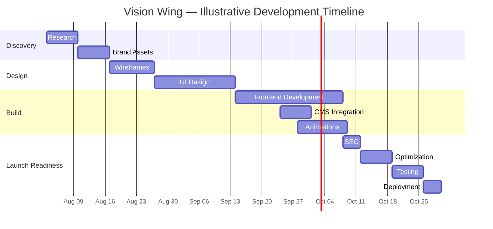

# Vision Wing — Project Phases

| | |
|---|---|
| **Project** | Vision Wing — Premium Marketing Agency Website |
| **Document** | Phases & Milestones |
| **Version** | 1.0 |
| **Status** | Draft for Planning Review |
| **Last Updated** | July 23, 2026 |
| **Illustrative Start Date** | Monday, August 3, 2026 |

## Table of Contents

1. [Timeline Overview](#1-timeline-overview)
2. [Phase 1 — Research](#phase-1--research)
3. [Phase 2 — Brand Assets](#phase-2--brand-assets)
4. [Phase 3 — Wireframes](#phase-3--wireframes)
5. [Phase 4 — UI Design](#phase-4--ui-design)
6. [Phase 5 — Frontend Development](#phase-5--frontend-development)
7. [Phase 6 — Animations](#phase-6--animations)
8. [Phase 7 — CMS](#phase-7--cms)
9. [Phase 8 — SEO](#phase-8--seo)
10. [Phase 9 — Optimization](#phase-9--optimization)
11. [Phase 10 — Testing](#phase-10--testing)
12. [Phase 11 — Deployment](#phase-11--deployment)
13. [Summary Table](#13-summary-table)

---

## 1. Timeline Overview

Estimated total: **~13 calendar weeks (~3 months)** from kickoff to launch, assuming one designer and 1–2 developers working substantially full-time, with Phases 6 and 7 running concurrently against the tail end of Phase 5 rather than strictly sequentially. Dates below are illustrative — anchor them to your actual kickoff date.

Note: Phase 6 (Animations) and Phase 7 (CMS) both start before Phase 5 (Frontend Development) fully ends — animation work needs built-but-unanimated sections to attach to, and CMS schema work can proceed in parallel with static section development once page templates exist.

---

## Phase 1 — Research

**Deliverables**
- Competitive audit of 5–7 comparable agencies (positioning, visual language, information architecture — used to confirm Vision Wing does *not* converge on generic agency-site patterns)
- Stakeholder interview notes (goals, non-negotiables, internal politics/approval chain)
- Draft sitemap (validates the 12-section brief structure against real content availability)
- Content audit — inventory of existing copy, logos, case study material, testimonials that can be reused vs. must be created
- Technical feasibility notes (CMS content modeling implications, any existing domain/DNS constraints)

**Estimated Time:** 5 business days (1 week)

**Dependencies:** Signed-off brief (this documentation set); stakeholder availability for interviews; access to any existing analytics/brand assets

**Completion Criteria:**
- [ ] Sitemap approved by stakeholders
- [ ] Draft personas circulated and validated against real sales/customer knowledge
- [ ] Positioning statement (PRD §5) confirmed with no major objections

**Risks**
| Risk | Mitigation |
|---|---|
| Incomplete stakeholder access delays persona accuracy | Timebox interviews to 3 business days; proceed with best-available synthesis and flag assumptions explicitly rather than blocking the schedule |
| Competitive set shifts positioning mid-research | Lock the competitive set at kickoff; treat later discoveries as roadmap notes, not scope changes |

---

## Phase 2 — Brand Assets

**Deliverables**
- Logo finalization: horizontal lockup, stacked lockup, icon-only mark, favicon set (the Globe/Wing/Eye mark at small sizes needs explicit simplification testing)
- Color token finalization, including the contrast validation documented in [Design.md § Color System](./Design.md#color-system)
- Typography confirmation: League Spartan + DM Sans loaded and license-verified for web use
- Photography/illustration mood board (see [Design.md § Photography Style](./Design.md#photography-style))
- Motion mood reel — 3–5 reference clips establishing the "restrained, precise" motion language before any production animation work begins

**Estimated Time:** 5 business days (1 week), can begin 1–2 days before Phase 1 fully closes

**Dependencies:** Phase 1 positioning sign-off

**Completion Criteria:**
- [ ] All logo lockups approved, including a small-size legibility check (favicon, nav-bar scale)
- [ ] Full color palette validated against WCAG AA (see Design.md)
- [ ] Type scale confirmed across desktop/tablet/mobile

**Risks**
| Risk | Mitigation |
|---|---|
| Icon mark loses legibility at favicon size (16–32px) | Design a simplified single-element variant (e.g., Eagle Eye only) for favicon/small-scale use rather than forcing the full three-element mark down to 16px |
| Font licensing/hosting surprises | Low risk — League Spartan and DM Sans are both open-source Google Fonts (SIL Open Font License); confirm self-hosting via `next/font` in Phase 5 rather than a runtime Google Fonts request, for performance |

---

## Phase 3 — Wireframes

**Deliverables**
- Low-fidelity wireframes for all 12 sections across desktop, tablet, and mobile breakpoints
- User flow diagrams (see [PRD.md § User Journey](./PRD.md) narrative)
- Content structure / copy-deck skeleton (headline, subhead, body length targets per section)
- Annotated interaction notes (what scrolls, what's sticky, what triggers on hover)

**Estimated Time:** 8 business days (~1.5 weeks)

**Dependencies:** Phase 1 sitemap; loose alignment with Phase 2 brand direction (wireframes are structural, not visual, but section proportions should anticipate the "large typography, generous whitespace" brief)

**Completion Criteria:**
- [ ] Wireframes approved with no outstanding structural objections
- [ ] Content-length assumptions validated against real available copy (no section wireframed for content that doesn't exist yet)

**Risks**
| Risk | Mitigation |
|---|---|
| Stakeholder scope creep — new sections requested mid-wireframe | Freeze the 12-section structure at Phase 1 sign-off; new-section requests become Future Roadmap items (PRD §17) unless formally re-scoped |
| Wireframes under-specify how sections read on tablet (the most commonly under-designed breakpoint) | Explicitly wireframe tablet, not just "it'll probably be fine between mobile and desktop" |

---

## Phase 4 — UI Design

**Deliverables**
- Full high-fidelity design files for every section, across desktop/tablet/mobile
- A Figma (or equivalent) component library matching [Design.md § Component Library](./Design.md#component-library)
- An interactive prototype demonstrating the logo reveal, nav transparent-to-solid transition, and at least one full scroll-through of the narrative
- Developer handoff annotations (spacing, tokens, states) per the format in Design.md

**Estimated Time:** 13 business days (~2.5 weeks)

**Dependencies:** Phase 3 wireframe approval; Phase 2 brand assets finalized

**Completion Criteria:**
- [ ] Full design sign-off from stakeholders
- [ ] Design QA'd against Design.md's token system (no off-system hex values, spacing, or type sizes)
- [ ] All interactive states designed — hover, focus, active, disabled, error, empty, loading — not just the default state

**Risks**
| Risk | Mitigation |
|---|---|
| Revision loops on the Hero (common on high-visibility brand pages) | Cap formal revision rounds at 3; additional exploration happens as internal variants before stakeholder review, not as open-ended review cycles |
| Design exceeds what's feasible in the animation budget (PRD §14 performance targets) | Have a developer sanity-check the motion mood reel (Phase 2) and any GSAP-dependent concepts before high-fidelity design is finalized, not after |

---

## Phase 5 — Frontend Development

**Deliverables**
- Next.js project scaffolded per [Architecture.md § Folder Structure](./Architecture.md#2-folder-structure)
- All 12 sections built as static, responsive components (pre-animation)
- Tailwind config wired to the design tokens (Architecture.md §16 / Design.md §Design Tokens)
- ShadCN primitives integrated and skinned to the token system
- Semantic HTML and baseline accessibility markup in place from the start (not retrofitted in Phase 10)

**Estimated Time:** 18 business days (~3.5 weeks)

**Dependencies:** Phase 4 sign-off on at least the core above-the-fold sections (Hero, Nav) to unblock start; full sign-off for remaining sections

**Completion Criteria:**
- [ ] All sections match approved design within a 1–2px implementation tolerance
- [ ] Fully responsive at all breakpoints defined in [Design.md § Responsive Breakpoints](./Design.md#responsive-breakpoints)
- [ ] Baseline Lighthouse pass (pre-animation) with no structural red flags

**Risks**
| Risk | Mitigation |
|---|---|
| Editorial/asymmetric layouts are harder to make responsive than standard grid-based SaaS templates | Budget explicit extra QA time on the tablet breakpoint specifically — historically the weakest link for large-type editorial layouts |
| Section components become tightly coupled, blocking Phase 6/7 parallel work | Enforce the `components/sections/` + `components/motion/` + CMS-query separation from Architecture.md from day one |

---

## Phase 6 — Animations

**Deliverables**
- Framer Motion variants for all scroll-triggered reveals and hover/micro-interactions
- The `AnimatedLogo` line-draw sequence (Globe → Wing → Eye), GSAP-based only if Framer Motion's native path animation proves insufficient
- Lenis smooth-scroll integration, wired as the single scroll-truth source (Architecture.md §6)
- Custom cursor (`CursorAperture`) interaction
- Full `prefers-reduced-motion` fallback for every animated element

**Estimated Time:** 8 business days (~1.5 weeks), overlapping the final ~1.5 weeks of Phase 5

**Dependencies:** Core sections built (not necessarily 100% of Phase 5) so there's something to animate

**Completion Criteria:**
- [ ] All animations sustain 60fps on a mid-tier mobile device (tested on real hardware, not desktop Chrome DevTools throttling alone)
- [ ] `prefers-reduced-motion` verified against every single animated element, not just the logo reveal
- [ ] Zero layout shift introduced by any animation (CLS budget maintained)

**Risks**
| Risk | Mitigation |
|---|---|
| Framer Motion + GSAP + Lenis scroll-listener conflicts (jank, double-firing triggers) | Establish Lenis as sole scroll-truth source before any GSAP ScrollTrigger or Framer `useScroll` is wired in — architectural decision, not a late fix (see Architecture.md §6) |
| Safari-specific scroll/animation bugs | Explicit Safari device testing scheduled in this phase, not deferred entirely to Phase 10 |

---

## Phase 7 — CMS

**Deliverables**
- Sanity Studio configured with the schemas defined in [Architecture.md § CMS Integration](./Architecture.md#10-cms-integration) (`project`, `insight`, `testimonial`, `faqItem`, `siteSettings`)
- Preview mode wired between Sanity and the Next.js draft experience
- Any existing content (from Phase 1's content audit) migrated into Sanity
- Webhook → on-demand ISR revalidation configured and tested

**Estimated Time:** 5 business days, overlapping Phase 5/6

**Dependencies:** Page templates for Featured Projects and Insights built in Phase 5 (schema needs a real template to validate against)

**Completion Criteria:**
- [ ] A non-developer team member can publish a new Insights article or Featured Project end-to-end without engineering help
- [ ] Preview mode accurately reflects unpublished changes against the live design system
- [ ] Publishing a change reliably triggers revalidation within an acceptable delay (target: under 60 seconds)

**Risks**
| Risk | Mitigation |
|---|---|
| Rigid schema fields don't accommodate real editorial flexibility (pull quotes, image breaks mid-article) | Use Portable Text (rich, block-based content) for body fields rather than plain rich-text or Markdown fields, per Architecture.md |
| Marketing team unfamiliar with Sanity Studio | Include a short recorded walkthrough as part of this phase's deliverable, not left as an implicit Phase 11 task |

---

## Phase 8 — SEO

**Deliverables**
- Metadata API implementation across every route
- Structured data (`Organization`, `Article`, `FAQPage`, `BreadcrumbList`) per [Architecture.md § SEO Strategy](./Architecture.md#7-seo-strategy)
- `sitemap.xml` / `robots.txt` generation verified
- Open Graph / Twitter Card images confirmed for every route, including a fallback generator for CMS entries missing a custom image
- Core Web Vitals baseline audit

**Estimated Time:** 4 business days

**Dependencies:** Phases 5 and 7 substantially complete (real templates and real content needed to validate metadata/structured data against actual pages, not placeholders)

**Completion Criteria:**
- [ ] Every page passes Google's Rich Results Test
- [ ] Sitemap successfully submitted to Search Console
- [ ] No duplicate or missing meta tags across any route

**Risks**
| Risk | Mitigation |
|---|---|
| Existing copy lacks keyword/search-intent strategy | Flag explicitly to stakeholders as a possible separate SEO-copywriting scope — this phase implements technical SEO, not content strategy |

---

## Phase 9 — Optimization

**Deliverables**
- Bundle analysis and code-splitting pass (`@next/bundle-analyzer`)
- Image optimization audit — AVIF/WebP delivery and lazy-loading confirmed sitewide
- Font subsetting and preload verification
- Lighthouse score tuning against the PRD §14 targets
- Third-party script audit (confirm nothing beyond the approved list in Architecture.md §1 has crept in)

**Estimated Time:** 5 business days (~1 week)

**Dependencies:** Feature-complete build (Phases 5–8 done)

**Completion Criteria:**
- [ ] Lighthouse Performance ≥ 90 mobile / ≥ 95 desktop
- [ ] LCP < 2.5s, CLS < 0.1, INP < 200ms
- [ ] Initial route JS payload within the <250KB gzipped target

**Risks**
| Risk | Mitigation |
|---|---|
| Combined animation libraries bloat the bundle beyond budget | Dynamic-import any GSAP usage and any below-the-fold heavy section logic; re-run bundle analysis, don't assume the Phase 5/6 implementation is already optimal |

---

## Phase 10 — Testing

**Deliverables**
- Cross-browser QA: Chrome, Safari, Firefox, Edge
- Real-device QA: iOS and Android (not emulators only)
- Accessibility audit: automated (axe or WAVE) + manual screen reader pass (VoiceOver and NVDA)
- Contact form submission testing, including spam-protection and error-state verification
- 404 and error-state testing
- Staging UAT session with stakeholders against the full Acceptance Criteria checklist (PRD §18)

**Estimated Time:** 5 business days (~1 week)

**Dependencies:** Phase 9 complete

**Completion Criteria:**
- [ ] Zero open critical or high-severity bugs
- [ ] WCAG 2.1 AA audit passed
- [ ] Stakeholder UAT sign-off obtained

**Risks**
| Risk | Mitigation |
|---|---|
| Safari-specific animation/scroll bugs (common with Lenis + GSAP combinations) surface late | Explicit, dedicated Safari test pass — do not treat "worked in Chrome" as sufficient signal |
| Accessibility issues found late require animation/interaction rework | Continuous accessibility checks during Phases 5–6 (not solely a Phase 10 gate) reduce the chance of a late structural surprise here |

---

## Phase 11 — Deployment

**Deliverables**
- Production deployment to Vercel on the live domain
- DNS cutover
- Environment variable audit across Production/Preview/Development
- Analytics (Vercel Analytics/Speed Insights, optionally Plausible) and Search Console verification live
- Post-launch monitoring (Sentry) confirmed receiving events
- Launch checklist sign-off (PRD §18 Acceptance Criteria, fully checked)

**Estimated Time:** 3 business days

**Dependencies:** Phase 10 sign-off

**Completion Criteria:**
- [ ] Site live on the production domain
- [ ] All redirects from any prior/legacy site in place (301s) — no broken inbound links or lost SEO equity
- [ ] Monitoring confirmed live and receiving real data
- [ ] Rollback plan documented and understood by the team

**Risks**
| Risk | Mitigation |
|---|---|
| DNS propagation delays launch-day timing | Schedule DNS changes with buffer time before any announced launch date/time |
| Missing 301 redirects from a legacy site cause an SEO drop | Require the complete legacy URL list *before* cutover, not discovered after — this should be gathered back in Phase 1's content audit |

---

## 13. Summary Table

| Phase | Duration | Overlaps with |
|---|---|---|
| 1. Research | 5 business days | — |
| 2. Brand Assets | 5 business days | Tail of Phase 1 |
| 3. Wireframes | 8 business days | — |
| 4. UI Design | 13 business days | — |
| 5. Frontend Development | 18 business days | — |
| 6. Animations | 8 business days | Tail of Phase 5 |
| 7. CMS | 5 business days | Tail of Phase 5 |
| 8. SEO | 4 business days | — |
| 9. Optimization | 5 business days | — |
| 10. Testing | 5 business days | — |
| 11. Deployment | 3 business days | — |
| **Total (sequential effort)** | **~79 business days (~15.8 weeks)** | |
| **Total (realistic calendar, with overlaps)** | **~65 business days (~13 weeks / ~3 months)** | |

---

*Related documents: [PRD.md](./PRD.md) · [Architecture.md](./Architecture.md) · [Design.md](./Design.md)*
